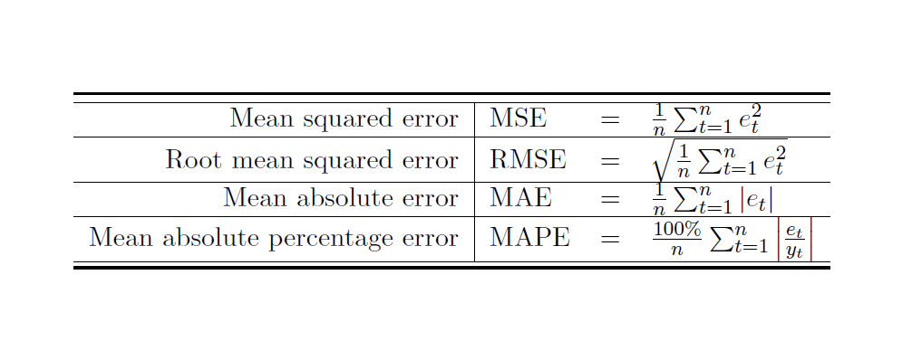

<p align="center">
  <a href="https://rossmann.de/">
    
  </a>

  <h3 align="center">Previsão de vendas nas lojas da Rossmann</h3>

  <p align="center">
    Previsão de Vendas nas lojas da Rossmann com base em dados anteriores
    <br>
    Numpy, Pandas, Seaborn, Matplotlib, XGBoost
    <br>
    <br>
    <a href="https://github.com/AnalogicAllergy/data_science/issues/new">Reportar um bug</a>
    ·
    <a href="https://github.com/AnalogicAllergy/data_science/issues/new">Requisitar uma feature</a>
  </p>
</p>

## Índice

- [Problema](#problema)
- [Dados](#dados)
- [Etapas CRISP-DS](#etapas-crisp-ds)
- [Progresso](#progresso)
- [Dependências](#dependencias)
- [Criador](#criador)
- [Agradecimentos](#gradecimentos)
- [Copyright](#copyright)

## Problema

> Rossmann operates over 3,000 drug stores in 7 European countries. Currently, Rossmann store managers are tasked with predicting their daily sales for up to six weeks in advance. Store sales are influenced by many factors, including promotions, competition, school and state holidays, seasonality, and locality. With thousands of individual managers predicting sales based on their unique circumstances, the accuracy of results can be quite varied.

A Rossmann detém cerca de 3000 farmácias em 7 cidades da Europa. Ao gerente de cada loja foi dada a tarefa de prever as suas vendas diárias até 6 semanas de antecedência. As vendas nas lojas são influenciadas por diversos fatores, dentre eles, promoções, competições, feriados escolares e estaduais, sasonalidade e localização. Com milhares de gerentes individuais predizendo vendas com base em circunstâncias únicas, a acurácia do resultado pode ser variada.

## Dados

> You are provided with historical sales data for 1,115 Rossmann stores. The task is to forecast the "Sales" column for the test set. Note that some stores in the dataset were temporarily closed for refurbishment.

Serão fornecidos dados históricos de venda de 1115 lojas da Rossmann. A tarefa é prever a columa "Vendas" no dataset de teste. Note que algumas lojas do dataset foram fechadas temporariamente para reformas

### Arquivos

Estão localizados no diretório `data`

> - train.csv - historical data including Sales
> - test.csv - historical data excluding Sales
> - sample_submission.csv - a sample submission file in the correct format
> - store.csv - supplemental information about the stores

### Campos de dados

> Most of the fields are self-explanatory. The following are descriptions for those that aren't.

> - Id - an Id that represents a (Store, Date) duple within the test set
>
> - Store - a unique Id for each store
> - Sales - the turnover for any given day (this is what you are predicting)
> - Customers - the number of customers on a given day
> - Open - an indicator for whether the store was open: 0 = closed, 1 = open
> - StateHoliday - indicates a state holiday. Normally all stores, with few > exceptions, are closed on state holidays. Note that all schools are closed on > public holidays and weekends. a = public holiday, b = Easter holiday, c = > Christmas, 0 = None
> - SchoolHoliday - indicates if the (Store, Date) was affected by the closure of > public schools
> - StoreType - differentiates between 4 different store models: a, b, c, d
> - Assortment - describes an assortment level: a = basic, b = extra, c = extended
> - CompetitionDistance - distance in meters to the nearest competitor store
> - CompetitionOpenSince[Month/Year] - gives the approximate year and month of the time the nearest competitor was opened
> - Promo - indicates whether a store is running a promo on that day
> - Promo2 - Promo2 is a continuing and consecutive promotion for some stores: 0 = store is not participating, 1 = store is participating
> - Promo2Since[Year/Week] - describes the year and calendar week when the store started participating in Promo2
> - PromoInterval - describes the consecutive intervals Promo2 is started, naming the months the promotion is started anew. E.g. "Feb,May,Aug,Nov" means each round starts in February, May, August, November of any given year for that store

## Etapas CRISP-DS

- [x] Descrição dos Dados
- [x] Feature Engineering
- [x] Filtragem de Variáveis
- [x] Análise Exploratória de Dados (EDA)
- [x] Preparação dos Dados
- [x] Seleção de Variáveis com Algoritmo
- [x] Modelos de Machine Learning
- [x] Hyperparameter Fine Tuning
- [x] Interpretação e Tradução do Erro

## Progresso

### Descrição dos Dados

- Entendimento do Negócio do cliente
- Definição das Etapas do CRISP-DS
- Renomear as colunas para padrão
- Investigação de Data Dimensions
- Investigação de Datatypes
- Checagem da existência de N/A
- Corrigindo os N/A com base em conhecimento de negócio
- Mudança dos tipos de dados após corrigir os N/A
- Estatística Descritiva das variáveis _numéricas_ (median, mean, std, skew, kurtosis)
- Estatística Descritiva das variáveis _categóricas_ (boxplot)

### Feature Engineering

- Criação do Mapa mental de hipóteses para motivar o feature engineering
- Escrita de hipóteses com base no fenômeno a ser modelado, nos agentes e nos atributos dos agentes
- Escolha da lista final de hipóteses
- Aplicação de Feature Engineering no dataset
- Derivação de variáveis com base nas features existentes

### Filtragem de Variáveis

- Aplicação de _filtragem_ de variáveis com base em _restrições_ de negócio
- Aplicação de _seleção_ de variáveis conforme a _importância_ para o modelo.

### Análise Exploratória de Dados

- Diferenciação entre análises univariada, bivariada e multivariada
- Análise exploratória de dados em variáveis univariadas numéricas e categóricas
- Análise de dados em variáveis bivariadas, onde podemos começar a validar as hipóteses que levantamos.
- Aprendizado do uso dos gráficos de barplot, regplot (que mostra tendências) e o gráfico de heatmap (que nos mostra a força da correlação entre variáveis)
- Validação das hipóteses de negócio com o uso de gráficos de heatmap, regplot e barplot
- Aplicação de técnicas de análise multivariada em variáveis numéricas e categóricas utilizando heatmap para as variáveis numéricas e calculo de Cramér V para variáveis categóricas.
  - > O V2 de Cramer mede a associação entre duas variáveis (a variável de linha e a variável de coluna). Os valores do V2 de variam entre 0 e 1. Os valores altos do V2 de Cramer indicam uma relação mais forte entre as variáveis, e os valores menores para o V2 indicam uma relação fraca. Um valor de 0 indica que não existe uma associação. Um valor de 1 indica que não há uma associação muito forte entre as variáveis.

### Preparação dos dados

- Aplicação de normalização de variáveis - quando necessário
- Aplicação de _rescaling_ utilizando técnicas de RobustScaling para variáveis com _outliers_ mais elevados
- Aplicação de _rescaling_ utilizando técnicas de MinMaxScaling para variáveis com _outliers_ menos elevados
- Aplicação de _encoding_ nas variáveis categóricas - LabelEncoding, One Hot Encoding e Ordinal Encoding
- Implementação da transformação de natureza das variáveis com características cíclicas (dia, mês, semana do ano, dia da semana) através de técnicas trigonométricas (sin e cos)

### Seleção de variáveis com algoritmo

- Visa entender a relevância das variáveis para o modelo.
- Definição de variáveis colineares e como lidar com elas
- Métodos de seleção de variáveis
- Seleção univariada
  > Busca encontrar qual o conjunto de variáveis melhor explica o fenômeno em estudo fazendo uso do coeficiente de correlação para selecionar as variáveis.
- Seleção por importância
  > A importância é calculada a partir da capacidade de uma variável conseguir particionar o conjunto de dados de maneira homogênea.
- Seleção por subset
  > A seleção por subconjuntos aplica uma sequência de passos ao testar como o modelo se comporta em termos de performance com a adição de variáveis ao conjunto de variáveis selecionadas e verificando a performance do modelo. Caso a performance aumente, a variável adicionada como teste e mantida, caso contrário, a mesma é removida.
- Algoritmo Boruta
  > Aplicação para selecionar o conjunto de variáveis mais relevantes para o modelo.

### Modelos de Machine Learning

- Apresentação dos modelos supervisionados, não supervisionados e semi-supervisionados (reinforcement learning)
- Apresentação das tarefas de classificação, regressão e clusterização
- Definição dos cinco melhores modelos para regressão dado o problema de previsão de vendas nas lojas
  - Modelo de Média
  - Regressão linear
  - Regressão linear regularizada
  - Random Forest
  - XGBoost
- Comparação de performance dos algoritmos de Machine Learning
- Realização de Cross Validation nos dados
- Comparação da performance dos modelos quanto aos dados com cross validation

### Hyperparameter Fine Tuning

- Seleção dos melhores parâmetros para o modelo a ser treinado.
- Aplicação dos tipos de Search para encontrar os valores dos parâmetros (Grid Search, Random Search e Bayesian Search)
  > No nosso caso, embora a Random Forest expresse melhores valores, iremos prosseguir com o XGBoost para aprofundarmos no Hyperparameter Fine Tuning. Após diversas iterações, chegamos aos valores ótimos de treinamento para o XGBoost:

```javascript
param_tuned = {
  n_estimators: 1900,
  eta: 0.03,
  max_depth: 9,
  subsample: 0.9,
  colsample_bytree: 0.7,
  min_child_weight: 3,
};
```

### Interpretação e tradução do erro

- Como interpretar os erros do modelo MAE, MAPE E RMSE para reporte negocial
- Criação de melhores e piores cenários de vendas

#### Erros e Fórmulas



#### Como utilizar os valores de erros para tomar decisão?

- Erros que ajudam a compreender a performance do modelo

  - RMSE
  - MPE

- Erros que ajudam a compreender a performance do negócio
  - MAE
  - MAPE
  - MPE

## Finalização do Projeto

- Nesse passo foi feito o deploy do modelo em produção no Heroku (API e Classe Preditora)

```python
import pickle
import inflection
import pandas as pd
import numpy as np
import math
import datetime


class Rossmann (object):
    def __init__(self):
        state = 1
        self.home_path = '/home/analogicallergy/Projetos/data_science/rossmann/'
        self.competition_distance_scaler = pickle.load(
            open(self.home_path + 'parameter/competition_distance_scaler.pkl', 'rb'))
        self.competition_time_month_scaler = pickle.load(
            open(self.home_path + 'parameter/competition_time_month_scaler.pkl', 'rb'))
        self.promo_time_week_scaler = pickle.load(
            open(self.home_path + 'parameter/promo_time_week_scaler.pkl', 'rb'))
        self.year_scaler = pickle.load(
            open(self.home_path + 'parameter/year_scaler.pkl', 'rb'))
        self.store_type_scaler = pickle.load(
            open(self.home_path + 'parameter/store_type_scaler.pkl', 'rb'))

    def data_cleaning(self, df1):

        cols_old = ['Store', 'DayOfWeek', 'Date', 'Open', 'Promo',
                    'StateHoliday', 'SchoolHoliday', 'StoreType', 'Assortment',
                    'CompetitionDistance', 'CompetitionOpenSinceMonth',
                    'CompetitionOpenSinceYear', 'Promo2', 'Promo2SinceWeek',
                    'Promo2SinceYear', 'PromoInterval']

        # definindo a função snakecase com lambda
        def snakecase(x): return inflection.underscore(x)

        # mapear as colunas antigas, fazendo com que a cada coluna seja aplicada a funcao snakecase
        # e retornando uma lista de novas colunas
        cols_new = list(map(snakecase, cols_old))

        df1.columns = cols_new

        df1.columns

        # veja que a data e um object e nao um datetime
        # como mudar

        df1['date'] = pd.to_datetime(df1['date'])

        # 1.5. Fillout N/A

        # competition_distance - a distancia do competidor mais proximo (ou nao tem competidor ou e muito longe pra competir)
        df1['competition_distance'] = df1['competition_distance'].apply(
            lambda x: 200000 if math.isnan(x) else x)
        # aplique em todas as linhas competition_distance 200000 se for um NaN, senao aplique o valor existente

        # competition_open_since_month - competidor mais proximo aberto
        df1['competition_open_since_month'] = df1.apply(lambda x: x['date'].month if math.isnan(
            x['competition_open_since_month']) else x['competition_open_since_month'], axis=1)

        # competition_open_since_year
        df1['competition_open_since_year'] = df1.apply(lambda x: x['date'].year if math.isnan(
            x['competition_open_since_year']) else x['competition_open_since_year'], axis=1)

        # promo2_since_week
        df1['promo2_since_week'] = df1.apply(lambda x: x['date'].week if math.isnan(
            x['promo2_since_week']) else x['promo2_since_week'], axis=1)

        # promo2_since_year
        df1['promo2_since_year'] = df1.apply(lambda x: x['date'].year if math.isnan(
            x['promo2_since_year']) else x['promo2_since_year'], axis=1)

        # promo_interval
        month_map = {1: 'Jan', 2: 'Feb', 3: 'Mar', 4: 'Apr', 5: 'May', 6: 'Jun',
                     7: 'Jul', 8: 'Aug', 9: 'Sep', 10: 'Oct', 11: 'Nov', 12: 'Dec'}
        df1['promo_interval'].fillna(0, inplace=True)
        df1['month_map'] = df1['date'].dt.month.map(month_map)

        # eh promocao quando a promo2 coincide com a date
        df1['is_promo'] = df1[['promo_interval', 'month_map']].apply(
            lambda x: 0 if x['promo_interval'] == 0 else 1 if x['month_map'] in x['promo_interval'].split(',') else 0, axis=1)

        # 1.6. Change Types

        df1['competition_open_since_month'] = df1['competition_open_since_month'].astype(
            int)
        df1['competition_open_since_year'] = df1['competition_open_since_year'].astype(
            int)
        df1['promo2_since_week'] = df1['promo2_since_week'].astype(int)
        df1['promo2_since_year'] = df1['promo2_since_year'].astype(int)

        return df1

    def feature_engineering(self, df2):

        # year
        df2['year'] = df2['date'].dt.year

        # month
        df2['month'] = df2['date'].dt.month
        # day
        df2['day'] = df2['date'].dt.day
        # week of year
        df2['week_of_year'] = df2['date'].dt.weekofyear
        # year week
        # concatenara o ano da data mais a semana do ano
        df2['year_week'] = df2['date'].dt.strftime('%Y-%W')

        # competition since
        # precisaremos compor a data atraves da uniao de duas colunas

        df2['competition_since'] = df2.apply(lambda x: datetime.datetime(
            year=x['competition_open_since_year'], month=x['competition_open_since_month'], day=1), axis=1)
        # tempo que a competicao comecou em meses - /30 me da a quantidade de meses
        df2['competition_time_month'] = (
            (df2['date'] - df2['competition_since']) / 30).apply(lambda x: x.days).astype(int)

        # promo since
        df2['promo_since'] = df2['promo2_since_year'].astype(
            str) + '-'+df2['promo2_since_week'].astype(str)
        df2['promo_since'] = df2['promo_since'].apply(lambda x: datetime.datetime.strptime(
            x+'-1', '%Y-%W-%w') - datetime.timedelta(days=7))
        # tempo da promocao ativa em semanas

        df2['promo_time_week'] = (
            (df2['date'] - df2['promo_since'])/7).apply(lambda x: x.days).astype(int)

        # assortment
        df2['assortment'] = df2['assortment'].apply(
            lambda x: 'basic' if x == 'a' else 'extra' if x == 'b' else 'extended')
        # state holiday
        df2['state_holiday'] = df2['state_holiday'].apply(
            lambda x: 'public_holiday' if x == 'a' else 'easter_holiday' if x == 'b' else 'christmas' if x == 'c' else 'regular_day')

        # 3.0. Filtragem de Variáveis

        # filtrar - deve levar em conta as restrições do negócio

        # 3.1. Filtragem das linhas

        df2 = df2[df2['open'] != 0]

        # 3.2. Seleção das colunas

        cols_drop = ['open', 'promo_interval', 'month_map']
        df2 = df2.drop(cols_drop, axis=1)

        return df2

    def data_preparation(self, df5):

        ## 5.2. Rescaling

        # aplicando o robustScaler
        df5['competition_distance'] = self.competition_distance_scaler.fit_transform(
            df5[['competition_distance']].values)
        # competition time month
        df5['competition_time_month'] = self.competition_time_month_scaler.fit_transform(
            df5[['competition_time_month']].values)

        # promotimeweek
        df5['promo_time_week'] = self.promo_time_week_scaler.fit_transform(
            df5[['promo_time_week']].values)

        # year
        df5['year'] = self.year_scaler.fit_transform(df5[['year']].values)

        ## 5.3. Transformação

        # 5.3.1. Encoding

        # fazendo one hot encoding no state holiday
        df5 = pd.get_dummies(
            df5, prefix=['state_holiday'], columns=['state_holiday'])

        # aplicando o label encoder na variavel store type
        df5['store_type'] = self.store_type_scaler.fit_transform(
            df5['store_type'])

        # aplicando o ordinal encoder na variavel assortment - assortment tem hierarquia
        #oe = OrdinalEncoder()

        # criando a ordem de importancia
        order = {'basic': 1, 'extended': 2, 'extra': 3}
        df5['assortment'] = df5['assortment'].map(order)

        # 5.3.3. Transformação de Natureza

        # month
        df5['month_sin'] = df5['month'].apply(
            lambda x: np.sin(x * (2 * np.pi/12)))
        df5['month_cos'] = df5['month'].apply(
            lambda x: np.cos(x * (2 * np.pi/12)))

        # day
        df5['day_sin'] = df5['day'].apply(lambda x: np.sin(x * (2 * np.pi/30)))
        df5['day_cos'] = df5['day'].apply(lambda x: np.cos(x * (2 * np.pi/30)))

        # week of year
        df5['week_of_year_sin'] = df5['week_of_year'].apply(
            lambda x: np.sin(x * (2 * np.pi/52)))
        df5['week_of_year_cos'] = df5['week_of_year'].apply(
            lambda x: np.cos(x * (2 * np.pi/52)))

        # day of week
        df5['day_of_week_sin'] = df5['day_of_week'].apply(
            lambda x: np.sin(x * (2 * np.pi/7)))
        df5['day_of_week_cos'] = df5['day_of_week'].apply(
            lambda x: np.cos(x * (2 * np.pi/7)))

        cols_selected = [

            'store',
            'promo',
            'store_type',
            'assortment',
            'competition_distance',
            'competition_open_since_month',
            'competition_open_since_year',
            'promo2',
            'promo2_since_week',
            'promo2_since_year',
            'competition_time_month',
            'promo_time_week',
            'month_sin',
            'month_cos',
            'day_sin',
            'day_cos',
            'week_of_year_sin',
            'week_of_year_cos',
            'day_of_week_sin',
            'day_of_week_cos'

        ]

        return df5[cols_selected]

    def get_prediction(self, model, original_data, test_data):
        # get prediction
        pred = model.predict(test_data)

        # join
        original_data['prediction'] = np.expm1(pred)

        return original_data.to_json(orient='records', date_format='iso')


```

```python
from flask import Flask, request, Response
import pickle
import os
import pandas as pd
from rossmann.Rossmann import Rossmann
# loading model
model = pickle.load(open(
    'model/model_xgb_tuned.pkl', 'rb'))

app = Flask(__name__)


@app.route('/rossmann/predict', methods=['POST'])
def rossmann_predict():
    test_json = request.get_json()

    if test_json:
        if isinstance(test_json, dict):
            test_raw = pd.DataFrame(test_json, index=[0])
        else:
            test_raw = pd.DataFrame(test_json, columns=test_json[0].keys())

        pipeline = Rossmann()
        # data cleaning
        df1 = pipeline.data_cleaning(test_raw)
        # feature engineering
        df2 = pipeline.feature_engineering(df1)

        # data preparation
        df3 = pipeline.data_preparation(df2)

        # prediction
        df_response = pipeline.get_prediction(model, test_raw, df3)
        return df_response

    else:
        return Response('{}', status=200, mimetype='application/json')


if __name__ == '__main__':
    port = os.environ.get('PORT', 5000)
    app.run(host='0.0.0.0', port=port)

```

- Disponibilização de um endpoint para consulta de previsão de vendas em uma loja específica
- Disponibilização de um bot no Telegram para consulta da previsão de vendas

## Previsões rodando no Telegram


## Ferramentas utilizadas

- Matplotlib
- Seaborn
- Pandas
- Numpy
- Pyenv
- Inflection
- IPython
- Scipy
- Sklearn
- Boruta
- XGBoost
- Heroku
- Flask

## Criador

**Willian Santana** aka _AnalogicAllergy_

## Agradecimentos

**Meigarom Fernandes**

- [GitHub](https://github.com/Meigarom)
- Canal: [Youtube](https://www.youtube.com/channel/UCar5Cr-pVz08GY_6I3RX9bA)

## Copyright

Fique a vontade para clonar, modificar e compartilhar!
